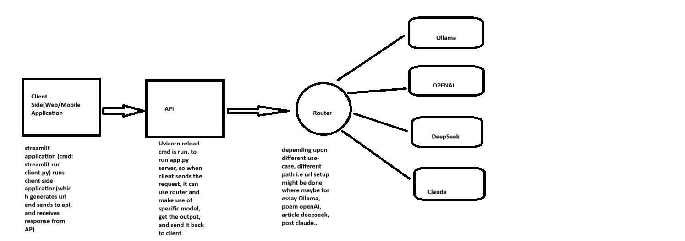

#we will be using LangServe component of LangChain, using which we will be creating FAST API's.
#we will have 4 components:
#component 1: Web App/Mobile App (Client App)
#component 2: api
#component 3 :Routes, Where these routes will make sure that whatever models we choose they will just redirect them to that specific model. 
Let's understand that we have a use case where a user might type an essay. They might be wanting an essay. So in that scenario, the route will be containing /essay. So whenever it has essay it will be sent to let's say Olama model. Whenever they want a poem it will be sent to another OpenAI model. So similarly, this is the job of the route that it can route it to each and every model depending upon the use case that we have. 

#component 4, where we can have multiple models - whichever models we want to use, could be an open-source or paid LLMs.

#Swagger UI: gives proper format for API documentation.

#NOTE: Server which is written on app.py using some uvconn command, and separately we'll be running another command which streamlit run client.py to run the client-side application. 

