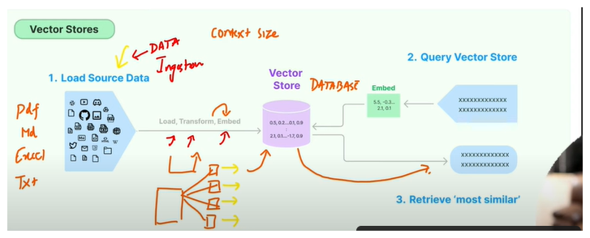

RAG stands for Retrieval-Augmented Generation, where it has two parts: Retrieval and Generation.

The job of Retrieval is to retrieve the data from the document from whatever the source is - it just gets the information.

The job of Generation is to reformat whatever the answer it has got and write it in a very human way. 

The objective of this rag is to make sure that the model doesn't have to remember anything. It just has to go to a place, find the answer, come back and just use the generation part to answer it.  

In case of LLM, we use an embedding layer. In case of the embedding layer, we convert our text into tokens and convert each token into a vector. Since this vector size might be huge or if our context is huge, in order to store that vector in our database, we have a specific database for this use case which is called vector db so that we can store our data over here and retrieve it efficiently. 

#simplerag.ipynb
1. Data injection: will be picking the data from the data.txt file, web page, pdf file
2.  Then we will split it in chunks
3. use embedding layer to convert it to vectors and store it into vector db
4. then run query to fetch the similar content from the db using similary score concept

Now we will see chain and retrieval, where chain connects multiple components together
such as retrieval + generation .